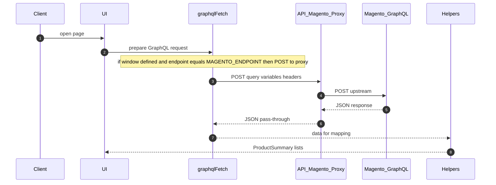
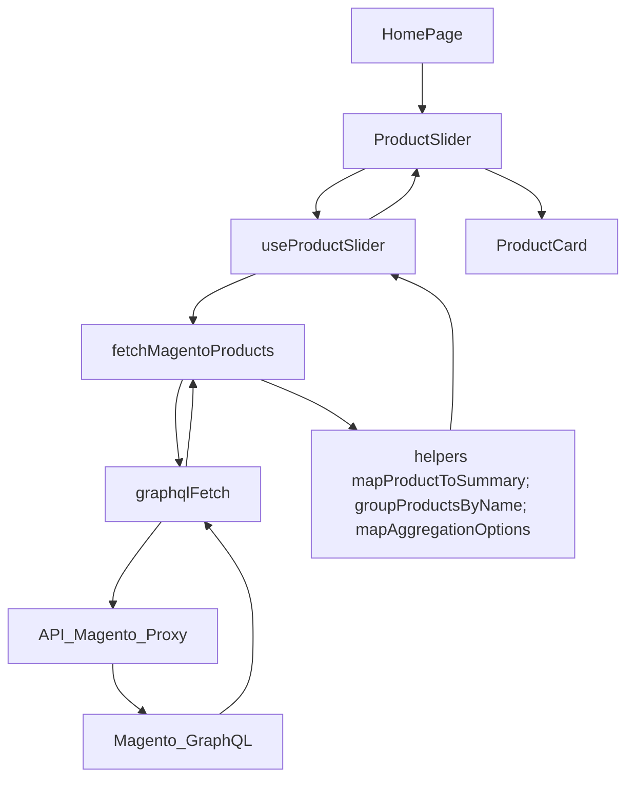
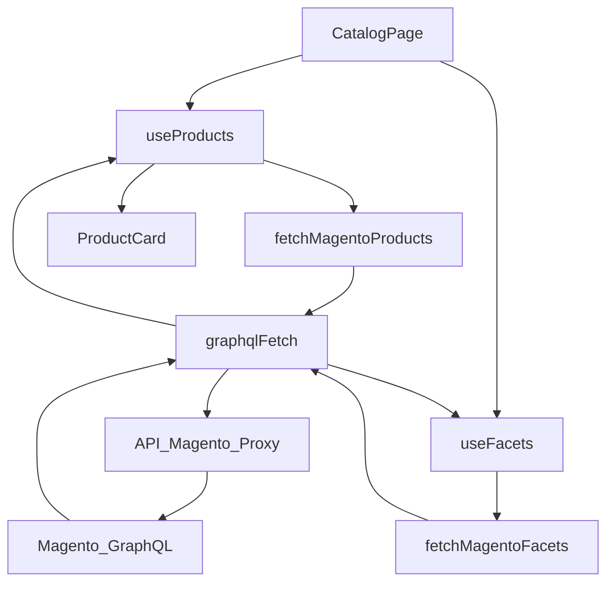
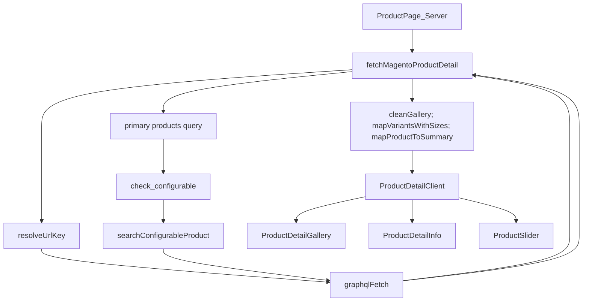
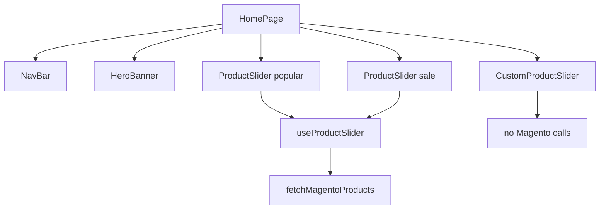

# Magento data flow map

This document visualizes how data flows and where Magento GraphQL requests occur across sliders, catalog, and product detail components.

Primary Magento request points:
- [TypeScript.graphqlFetch()](src/lib/graphql-client.ts:20)
- [TypeScript.POST()](src/app/api/magento/route.ts:13)
- [TypeScript.fetchMagentoProducts()](src/lib/magento.ts:30)
- [TypeScript.fetchMagentoFacets()](src/lib/magento.ts:268)
- [TypeScript.fetchMagentoProductDetail()](src/lib/magento.ts:416)
- [TypeScript.resolveUrlKey()](src/lib/magento.ts:660)
- [TypeScript.searchConfigurableProduct()](src/lib/magento.ts:709)

Helpers shaping Magento data:
- [TypeScript.mapProductToSummary()](src/lib/magento/helpers.ts:224)
- [TypeScript.groupProductsByName()](src/lib/magento/helpers.ts:37)
- [TypeScript.mapAggregationOptions()](src/lib/magento/helpers.ts:198)
- [TypeScript.mapVariants()](src/lib/magento/helpers.ts:269)
- [TypeScript.mapVariantsWithSizes()](src/lib/magento/helpers.ts:351)
- [TypeScript.cleanGallery()](src/lib/magento/helpers.ts:14)

Client hooks and pages:
- [TypeScript.useProductSlider()](src/hooks/useProductSlider.ts:8)
- [TypeScript.useProducts()](src/lib/api/magento.ts:12)
- [TypeScript.useFacets()](src/lib/api/magento.ts:33)
- [TypeScript.useProductDetail()](src/lib/api/magento.ts:44)
- [TypeScript.HomePage](src/app/page.tsx)
- [TypeScript.CatalogPage](src/components/catalog-page.tsx)
- [TypeScript.ProductDetailClient](src/components/product-detail/product-detail-client.tsx)

Configuration:
- [TypeScript.MAGENTO_ENDPOINT](src/lib/magento/constants.ts:1)
- [TypeScript.MAGENTO_STORE_HEADER](src/lib/magento/constants.ts:3)

System sequence: client to Magento via proxy

ProductSlider data flow

CatalogPage infinite products and facets flow

Pagination math and caching

Loaded items: $loaded = nPages \\times pageSize$
Next page condition: $loaded < totalCount$
Caching: react query stale time products $60\\,000\\,\\text{ms}$ facets $600\\,000\\,\\text{ms}$ product detail $300\\,000\\,\\text{ms}$

ProductDetail resolution and enrichment flow

HomePage component interaction graph

FiltersPanel behavior

- [TypeScript.FiltersPanel](src/components/filters-panel.tsx) does not call Magento; it updates state: selectedColor, priceRange, selectedRooms, selectedMaterials, selectedSizes.
- These states feed into [TypeScript.useProducts()](src/lib/api/magento.ts:12) and [TypeScript.useProductSlider()](src/hooks/useProductSlider.ts:8), which call [TypeScript.fetchMagentoProducts()](src/lib/magento.ts:30).

React Query configuration notes

- Products: infinite query with initial page 1; next page param uses $loaded = nPages \\times pageSize$ and compares to Magento $totalCount$.
- Facets: normal query with stale time $600\\,000\\,\\text{ms}$.
- Product detail: normal query with stale time $300\\,000\\,\\text{ms}$.
- Shared fetch proxy: [TypeScript.graphqlFetch()](src/lib/graphql-client.ts:20) proxies to [/api/magento](src/app/api/magento/route.ts) on client.

Code reference index

- [TypeScript.graphqlFetch()](src/lib/graphql-client.ts:20)
- [TypeScript.POST()](src/app/api/magento/route.ts:13)
- [TypeScript.fetchMagentoProducts()](src/lib/magento.ts:30)
- [TypeScript.fetchMagentoFacets()](src/lib/magento.ts:268)
- [TypeScript.fetchMagentoProductDetail()](src/lib/magento.ts:416)
- [TypeScript.resolveUrlKey()](src/lib/magento.ts:660)
- [TypeScript.searchConfigurableProduct()](src/lib/magento.ts:709)
- [TypeScript.mapProductToSummary()](src/lib/magento/helpers.ts:224)
- [TypeScript.groupProductsByName()](src/lib/magento/helpers.ts:37)
- [TypeScript.mapAggregationOptions()](src/lib/magento/helpers.ts:198)
- [TypeScript.mapVariants()](src/lib/magento/helpers.ts:269)
- [TypeScript.mapVariantsWithSizes()](src/lib/magento/helpers.ts:351)
- [TypeScript.cleanGallery()](src/lib/magento/helpers.ts:14)
- [TypeScript.useProductSlider()](src/hooks/useProductSlider.ts:8)
- [TypeScript.useProducts()](src/lib/api/magento.ts:12)
- [TypeScript.useFacets()](src/lib/api/magento.ts:33)
- [TypeScript.useProductDetail()](src/lib/api/magento.ts:44)
- [TypeScript.HomePage](src/app/page.tsx)
- [TypeScript.CatalogPage](src/components/catalog-page.tsx)
- [TypeScript.ProductDetailClient](src/components/product-detail/product-detail-client.tsx)
- [TypeScript.MAGENTO_ENDPOINT](src/lib/magento/constants.ts:1)
- [TypeScript.MAGENTO_STORE_HEADER](src/lib/magento/constants.ts:3)

Summary

All Magento requests are centralized in [TypeScript.graphqlFetch()](src/lib/graphql-client.ts:20), which proxies through [TypeScript.POST()](src/app/api/magento/route.ts:13) on the client, and are initiated by fetchers in [TypeScript.fetchMagentoProducts()](src/lib/magento.ts:30), [TypeScript.fetchMagentoFacets()](src/lib/magento.ts:268), and [TypeScript.fetchMagentoProductDetail()](src/lib/magento.ts:416). UI components consume mapped data via hooks and helpers.